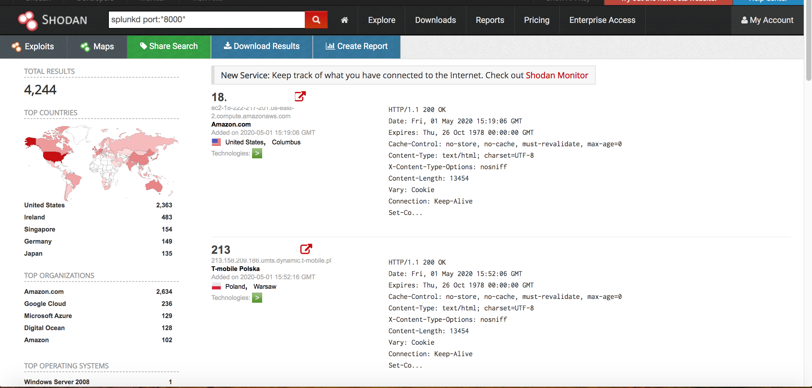
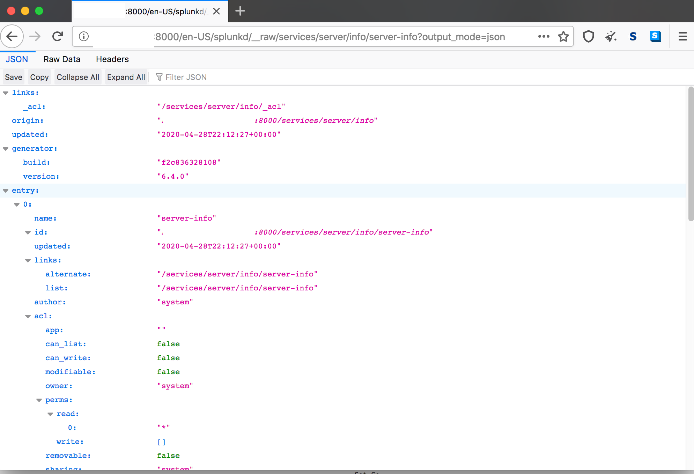
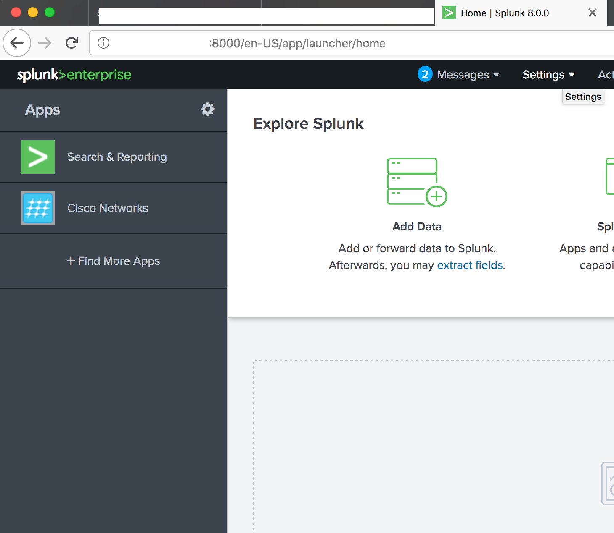
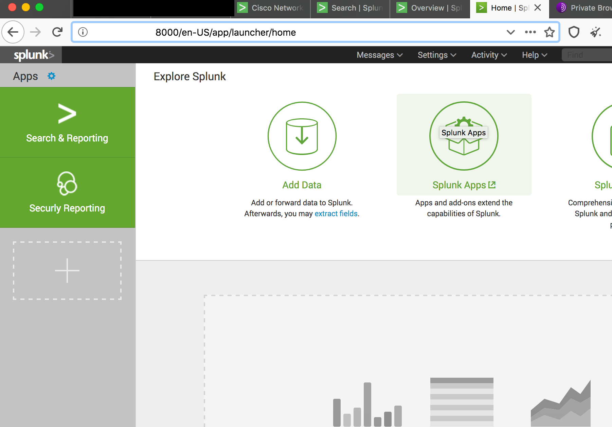
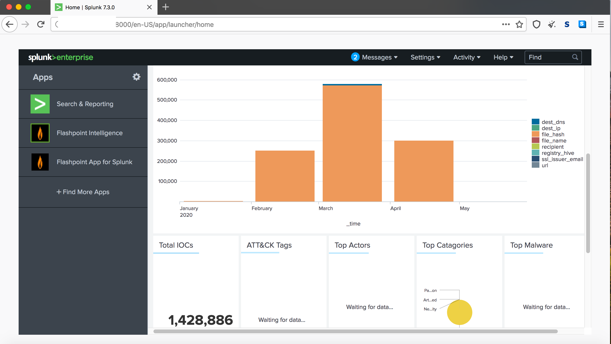

# OSINT de Splunk con Shodan

### Autor: José Moreno

Recientemente he estado retomando un poco la búsquedas de vulnerabilidades principalmente para no olvidar las técnicas de reconocimiento que todos debemos dominar, en mi caso siempre trato de buscar sobre los temas de moda o que están sonando en las tendencias de seguridad informática.

Me encontré on un artículo interesante donde explicaban que splunk tiene la vulnerabilidad  https://nvd.nist.gov/vuln/detail/CVE-2018-11409, que revela información sensitiva **__raw/services/server/info/server-info?output_mode=json **, mostrando información sobre la licencia.

Para comprobar si funciona solo debemos buscar en shodan con ls siguiente consulta **splunkd port:"8000"**

Antes de continuar vamos a explicar brevemente **¿Qué es Splunk?**

Splunk es una básicamente  una herramienta utilizada para monitoreo, búsquedas, analisis y visualización de data generada en tiempo real, de nuestros dispositivos conectados a la red, aplicaciones, infraestructuras de IT. Permite monitorear y leer diferetens tipos de registros (logs), almacena esta data como eventos indexados y permite correlacionar generando gráficos, alertas y paneles definidos por el usuario. Fuente: https://www.ifixed.cl/2017/06/14/que-es-splunk-big-data/

Para mi sorpresas no fue necesario ni siquiera escribir en el navegador  la url para probar si en efecto permitía la revelación de información de licencia con la consulta.

https://ip:8000/en-US/splunkd/__raw/services/server/info/server-info?output_mode=json

Basto con navegar hasta las 3 primeras páginas en shodan donde conseguimos vastos resultados de implementaciones de splunk sin ninguna autenticación

Luego de ir avanzando un poco logré encontrar muchas más implementaciones

Otro ejemplo de Splunk 

En la siguiente podemos ver que tiene una gráfica con indicadores de compromiso y están gráficando los diversas categorias de incidencias

Para terminar no necesarimente implica que la herramienta contengas fallas de seguridad, pues sabemos que como minimo debieron implementar una autenticación básica, que lo permite splunk, además que siempre podemos utilizar un proxy reversible para permitir el acceso a estos recursos solamemente a los host permitidos no expuestos directamente a internet. Nuevamente indicamos que esta investigación solo fue con fines educativos por lo que no probamos RCE ni movimiento laterales, tampoco ningún modificación o alteración de los indicadores que tenian definidos. 

